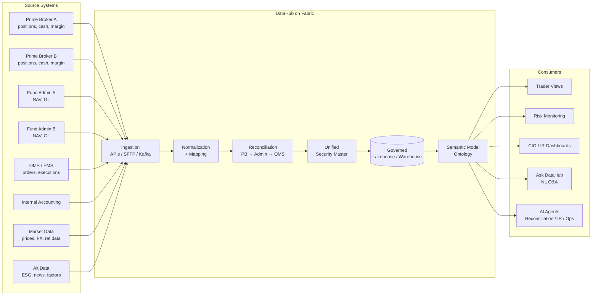

# DataHub on Microsoft Fabric — Green Meadows Demo

> **Solution:** *Financial Fabric — DataHub for Capital Markets* deployed on Microsoft Fabric.
> **Persona:** **Sarah Chen**, COO / CDO of **Green Meadows**, a $2B multi-strategy platform running multiple prime brokers, fund administrators, and internal systems.
> **Goal:** Show how DataHub turns Monday-morning data chaos into a governed, trusted foundation that powers PMs, Risk, IR, Ops — and AI agents — from the same data.

---

## The Story

### The Firm
**Green Meadows** — $2B multi-strategy platform. Multiple prime brokers, multiple fund administrators, multiple internal systems (OMS, EMS, accounting, CRM).

### The Persona
**Sarah Chen — COO / CDO.** Accountable for ensuring PM, Risk, Investor Relations, and Operations are aligned off the **same** data.

- Her **ops team** spends > **60%** of its time reconciling data instead of analyzing it.
- Her **data team** spends most of its time on ingestion, normalization, and cleanup — not building analytics or tools.

### The Pain (Monday morning)
The firm needs a consolidated view of **NAV, exposures, and risk** across funds and strategies. Today:

- Data arrives from primes, admins, and internal systems on **different schedules**.
- Definitions and mappings **don't fully align** across providers.
- Positions, cash, and transactions still require **manual reconciliation**.

So instead of starting the week with **decision-making**, the firm spends hours **aligning and validating** data before it can be used — and is always behind the ball.

### The DataHub Solution

Overnight, **DataHub** ingests, normalizes, and reconciles data across all sources, constructs a **unified security master**, and publishes **governed datasets** into Microsoft Fabric.

By Monday morning, Green Meadows isn't bogged down assembling and reconciling data — it's operating on a **consistent, trusted foundation** across all teams.

As the trading day progresses, **real-time data** is streamed alongside the overnight foundation and delivered into:
- Trader views
- Risk monitoring
- CIO / IR dashboards

On top of this, **Ask DataHub** provides a direct natural-language interface — letting users query the data, generate insights, and deploy **AI agents** to automate workflows across the firm.

---

## Solution at a Glance



---

## Repo Structure

```
DataHub_Fabric_Demo/
├── README.md
├── docs/
│   ├── 01-story-and-personas.md
│   ├── 02-architecture.md
│   ├── 03-data-sources.md            # Primes, admins, OMS, market, alt
│   ├── 04-ingestion-and-normalization.md
│   ├── 05-reconciliation.md          # PB ↔ Admin ↔ OMS breaks
│   ├── 06-unified-security-master.md
│   ├── 07-governed-datasets-fabric.md
│   ├── 08-realtime-streaming.md
│   ├── 09-ask-datahub.md             # NL Q&A over Fabric
│   ├── 10-ai-agents.md               # Foundry agents, automation
│   └── 11-demo-script.md             # Run-of-show
├── data/
│   ├── schemas/                      # DDL for canonical model
│   └── sample/                       # Synthetic source extracts
├── fabric/
│   ├── lakehouses/                   # Bronze / Silver / Gold layouts
│   ├── notebooks/                    # PySpark for ingest, normalize, reconcile
│   └── pipelines/                    # Data Factory pipelines
├── ontology/
│   └── datahub.ontology.json
├── agents/
│   ├── ask-datahub/                  # NL interface config
│   └── ai-foundry/                   # Reconciliation / IR / Ops agents
└── .gitignore
```

---

## Quick Start

1. **Story & personas** — [docs/01-story-and-personas.md](docs/01-story-and-personas.md)
2. **Architecture** — [docs/02-architecture.md](docs/02-architecture.md)
3. **Data sources** — [docs/03-data-sources.md](docs/03-data-sources.md)
4. **Ingestion & normalization** — [docs/04-ingestion-and-normalization.md](docs/04-ingestion-and-normalization.md)
5. **Reconciliation** — [docs/05-reconciliation.md](docs/05-reconciliation.md)
6. **Unified Security Master** — [docs/06-unified-security-master.md](docs/06-unified-security-master.md)
7. **Governed datasets in Fabric** — [docs/07-governed-datasets-fabric.md](docs/07-governed-datasets-fabric.md)
8. **Real-time streaming** — [docs/08-realtime-streaming.md](docs/08-realtime-streaming.md)
9. **Ask DataHub** — [docs/09-ask-datahub.md](docs/09-ask-datahub.md)
10. **AI Agents** — [docs/10-ai-agents.md](docs/10-ai-agents.md)
11. **Demo script** — [docs/11-demo-script.md](docs/11-demo-script.md)
