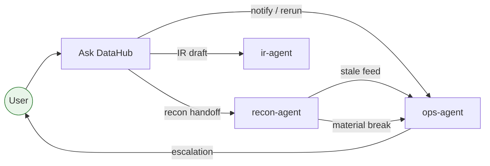

# Agents

Agent specifications powering the Green Meadows DataHub demo.

## Roster

| Agent          | Folder                                              | Purpose                                                  |
|----------------|-----------------------------------------------------|----------------------------------------------------------|
| `Ask DataHub`  | [`ask-datahub/`](ask-datahub/)                      | Natural-language Q&A over the Fabric semantic model.     |
| `recon-agent`  | [`ai-foundry/recon-agent/`](ai-foundry/recon-agent/)| Detect, classify, resolve PB ↔ Admin ↔ EMS breaks.       |
| `ir-agent`     | [`ai-foundry/ir-agent/`](ai-foundry/ir-agent/)      | Draft LP letters, Q&A, earnings briefings.               |
| `ops-agent`    | [`ai-foundry/ops-agent/`](ai-foundry/ops-agent/)    | Pipeline reruns, threshold alerts, daily distributions.  |

## Interaction model

## Common contract

All agents follow these rules:

1. **Grounded only in `CapMarket_DataHub`** semantic model + `CapMarket_LH` lakehouse.
2. **Read-only by default**; writes go through approved jobs/tools listed in each agent's instructions.
3. **Audit everything** — every action appends to a domain audit table (`recon_audit`, `ops_audit`, etc.).
4. **Respect Fabric RLS** — never bypass workspace permissions.
5. **Idempotent** — repeated triggers for the same input must not duplicate side effects.
