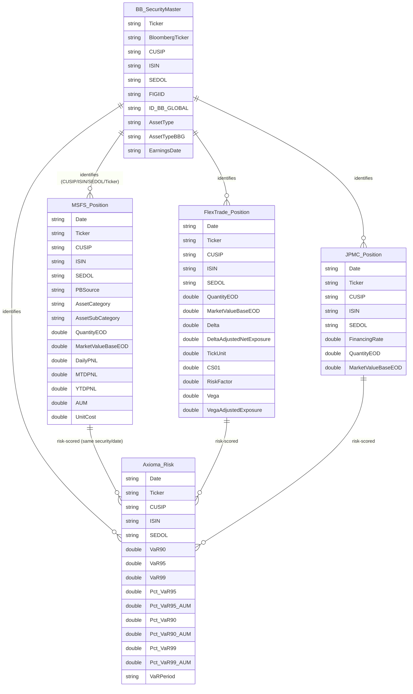

# CapMarket DataHub - Source Ontology

Derived from the Lakehouse DDL in [`fabric/ddl_export.sql`](../fabric/ddl_export.sql).
`DataHub_Position` (the mastered/golden table) is intentionally omitted to focus on source-system entities.

## Notes

- **Reference layer:** `BB_SecurityMaster` carries the canonical Bloomberg identifiers (`FIGIID`, `ID_BB_GLOBAL`).
- **Common join key:** `Date` + (`CUSIP` | `ISIN` | `SEDOL` | `Ticker`) + `PortfolioManager` + `PositionGroup`.
- **Source specialization:**
  - `MSFS_Position` (admin) - PnL (`DailyPNL/MTDPNL/YTDPNL`), `AUM`, `UnitCost`, classification
  - `FlexTrade_Position` (EMS) - Greeks (`Delta`, `Vega`), risk factors, exposures
  - `JPMC_Position` (custody) - `FinancingRate`
  - `Axioma_Risk` - VaR suite (`VaR90/95/99`, `Pct_VaR*`)
