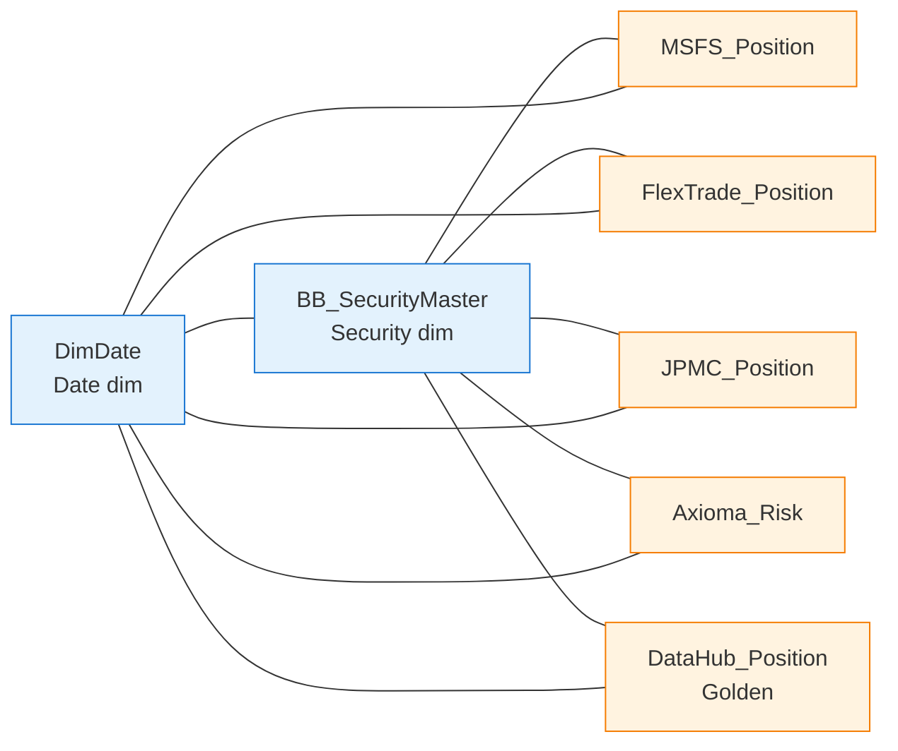

# CapMarket DataHub — Fabric Semantic Model (TMDL)

This folder contains a **Power BI / Fabric semantic model** in [TMDL](https://learn.microsoft.com/power-bi/developer/projects/projects-tmdl) format, sourced from the Lakehouse `CapMarket_LH` defined in [`fabric/ddl_export.sql`](../fabric/ddl_export.sql).

## Layout

```
semantic-model/CapMarket_DataHub.SemanticModel/
├── .platform                      # Fabric Git-integration metadata
├── definition.pbism               # PBI semantic model marker
├── model.tmdl                     # Model header + table/relationship refs
├── relationships.tmdl             # All relationships
└── tables/
    ├── BB_SecurityMaster.tmdl     # Reference (master) - dimension role
    ├── MSFS_Position.tmdl         # Admin source - PnL / AUM
    ├── FlexTrade_Position.tmdl    # EMS source   - Greeks / CS01
    ├── JPMC_Position.tmdl         # Custody source
    ├── Axioma_Risk.tmdl           # Risk overlay - VaR
    ├── DataHub_Position.tmdl      # Golden mastered table (with measures)
    └── DimDate.tmdl               # Calculated date dimension
```

## Star schema



All fact tables relate to `BB_SecurityMaster` on **CUSIP** and to `DimDate` on **Date**.

## Storage mode

Partitions use **Direct Lake** against the `CapMarket_LH` Lakehouse — no data import; queries hit OneLake Delta tables directly.

## Key measures (on DataHub_Position)

| Group         | Measure                       |
|---------------|-------------------------------|
| Core          | Total Market Value, Total AUM, Daily PnL, MTD PnL, YTD PnL |
| Risk          | Net Delta Exposure, Total CS01, Total Vega, Total VaR95, Total VaR99, VaR95 % of AUM |
| Performance   | YTD Sharpe (AUM-weighted), YTD Volatility (AUM-weighted) |

Source-specific roll-ups (e.g. `MSFS Total MV`, `JPMC Total MV`, `Avg Financing Rate (bps)`) live on each source table for reconciliation views.

## Deploying to Fabric

### Option A — Fabric Git integration (recommended)
1. In the Fabric workspace hosting `CapMarket_LH`, enable **Workspace settings → Git integration** and connect to `pratpat/DataHub_Fabric_Demo`, branch `main`, folder `/semantic-model`.
2. Click **Update all** to materialize `CapMarket_DataHub` as a Semantic Model item.

### Option B — Power BI Desktop (TMDL preview)
1. Open Power BI Desktop (April 2024+) with **TMDL view** enabled.
2. *File → Open* → select `CapMarket_DataHub.SemanticModel/definition.pbism`.
3. Publish to the Fabric workspace.

### Option C — `fabric-cli` / REST
```pwsh
fab create item --workspace 'My workspace' --type SemanticModel --definition ./semantic-model/CapMarket_DataHub.SemanticModel
```
